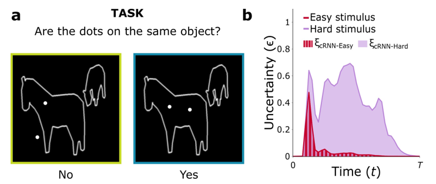
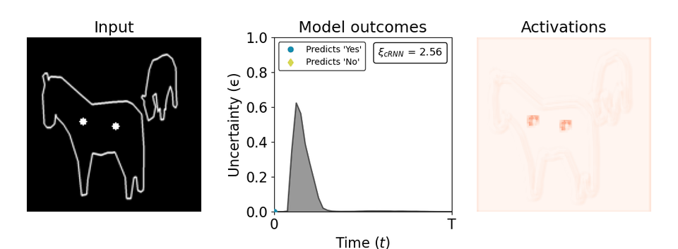
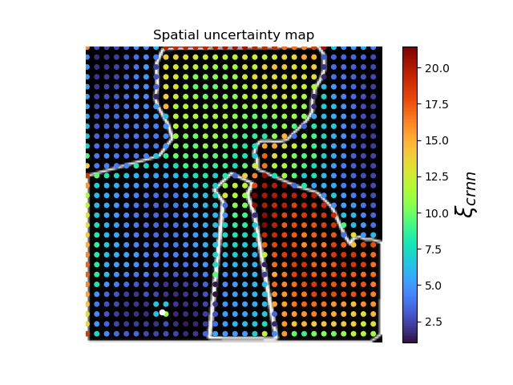

<h1 align="center">
  <br>
  <br>
  Computing a human-like reaction time metric from stable recurrent vision  models
  <br>
</h1>

<h4 align="center">Lore Goetschalckx*, Lakshmi N. Govindarajan*, Alekh K. Ashok, Aarit Ahuja, David L. Sheinberg, & Thomas Serre</h4>

<p align="center" style="text-align: center">
<a href="https://www.python.org"></a>
<a href="https://pytorch.org"></a>
<a href="https://serre-lab.github.io/rnn_rts_site/"></a>
<a href="https://opensource.org/licenses/MIT"></a>
</p>


<p align="center">
  <a href="#about">About</a> •
  <a href="#datasets">Datasets</a> •
  <a href="#computing-ξ">Computing ξ</a> •
  <a href="#spatial-uncertainty-maps">SU maps</a> •
  <a href="#training">Training</a> •
  <a href="#citation">Citation</a> •
  <a href="#license">License</a>
</p>

<div align="center" width="400">
 <br> 
<p style="font-size:12px;text-align: left;font-style: italic">We find a way to quantify the internal recurrent dynamics of a large-scale vision model by devising a metric ξ based on subjective logic theory. We use the metric to study <b>temporal</b> human-model alignment on different (and challenging) visual cognition tasks (e.g., incremental grouping task shown here). More in our <a href="https://arxiv.org/abs/2306.11582">paper</a>.
</p>

</div>

## About
This repo contains the PyTorch implementation for our framework to train, analyze, and interpret the dynamics of convolutional recurrent neural networks (cRNNs).
We include Jupyter notebooks to demonstrate how to compute ξ, our stimulus-computable, task- and model-agnostic metric that can be compared directly against human RT data. Code to train your own models is included as well.

<a href="https://arxiv.org/abs/2306.11582">Paper</a>  • <a href="https://serre-lab.github.io/rnn_rts_site/">Project page</a> 

## Datasets
Please refer to <a href="./data">the data folder</a> for more information on how to download and use our full datasets for the
incremental grouping task ("Coco Dots") and the maze task, if you'd like to use those. <b>Note</b>, however, that the notebooks should
run without any additional downloads too. The demonstrations use a mini version of the Coco Dots dataset that's included in this repo.  


## Computing ξ
As explained in the paper, we model uncertainty (ϵ) explicitly and track its evolution over time in the cRNN.
We formulate our RT metric (ξcRNN) as the area under this uncertainty curve. You can find a demo of how to generate these
curves and extract ξ in: 

<a href="uncertainty_curves.ipynb">uncertainty_curves.ipynb </a> 

 

## Spatial uncertainty maps
Specifically for the incremental grouping task, we introduced spatial uncertainty maps to probe a cRNN's visual strategies. For a given outline stimulus, one dot (indicated in white) is kept fixed while the position of the other is varied. Each position in the map has a value corresponding to the ξ for the respective dot configuration (fixed dot + other dot). You can find a demo of how to produce such maps in:

<a href="spatial_uncertainty_maps.ipynb">spatial_uncertainty_maps.ipynb</a>.



## Training
Below is an example of how to use <a href="train.py">train.py</a> for the incremental grouping task.


```
python train.py cocodots_train cocodots_val --batch_size 32 --data_root ./data/coco --name mymodel --model hgru --kernel_size 5 --timesteps 40 --loss_fn EDL --annealing_step 16 --algo rbp --penalty --penalty_gamma 100

```

<b>Note</b> that this assumes you have downloaded the MS COCO training and valiation images in ./data/coco and downloaded 
our Coco Dots annotation files in ./data. More details in <a href="data"> data </a>. If you'd like to try out the code without downloading more data, you can play 
around with cocodots_val_mini, which is included here already for demo purposes.

## Citation
If you'd like to use any of the code, figures, weights, or data in this repo for your own work, please cite our paper:


```
@misc{goetschalckx2023computing,
      title={Computing a human-like reaction time metric from stable recurrent vision models}, 
      author={Lore Goetschalckx and Lakshmi Narasimhan Govindarajan and Alekh Karkada Ashok and Aarit Ahuja and David L. Sheinberg and Thomas Serre},
      year={2023},
      eprint={2306.11582},
      archivePrefix={arXiv},
      primaryClass={cs.CV}
}
```

## License

MIT

---


