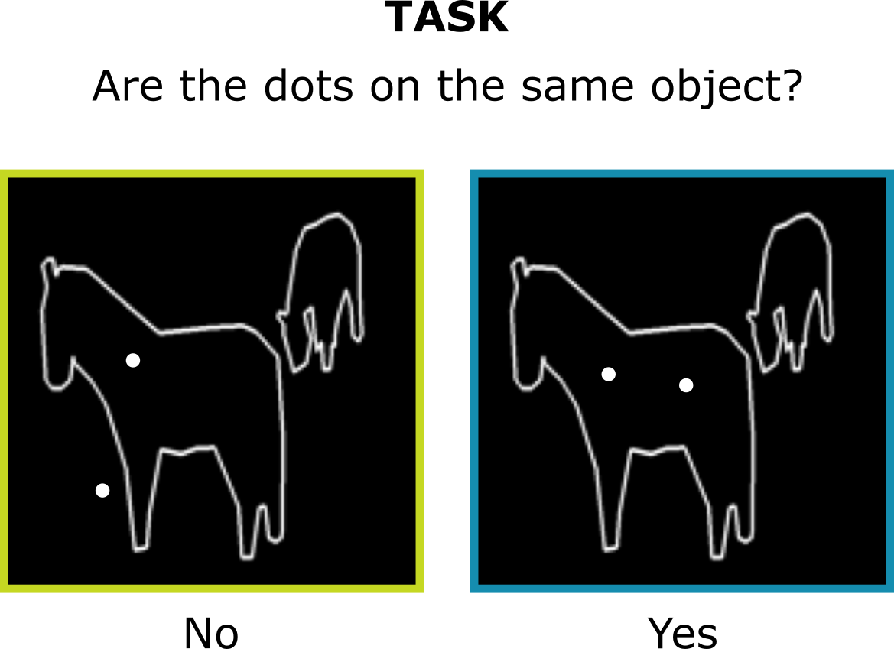
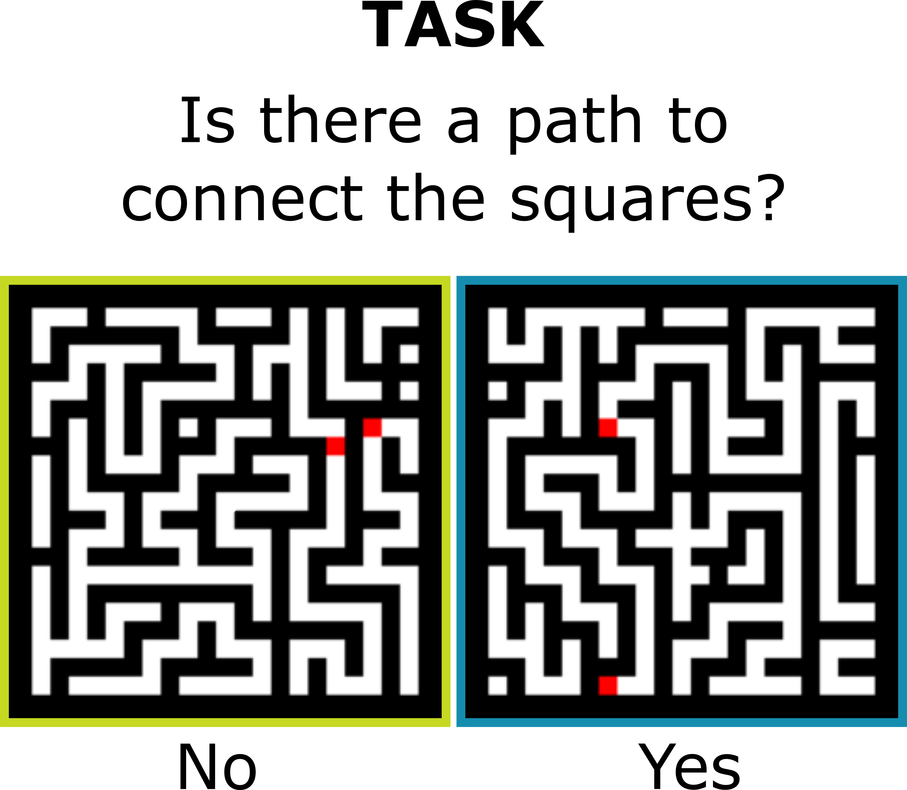

# Data

We include instructions on how to download and use the datasets used in  our <a href="https://arxiv.org/abs/2306.11582">paper</a> on computing a human-like RT metric from recurrent vision models.
- <a href="#coco-dots">Coco Dots</a> (incremental grouping task)
- <a href="#mazes">Mazes</a>

<b>Note</b>: both of these datasets used prior datasets as a starting point.


## Coco Dots


COCO Dots is based on the original COCO panoptic segmentation dataset. It was designed to train models on an incremental grouping task similar to the one used in a human psychophysics study by Jeurissen et al. (2016). The most important addition to the original COCO panoptic json-file is the `serrelab_anns` key.

The format of the original annotation file can be found here: [COCO 2017 Annotations Format](https://cocodataset.org/#format-data)

We have modified the annotations file to include the following, highlighted fields:


### Usage
1. Download the COCO 2017 train and validation datasets and:
  -  [2017 Train Images](http://images.cocodataset.org/zips/train2017.zip)
  -  [2017 Val Images](http://images.cocodataset.org/zips/val2017.zip)

2. Download our modified Annotation files and save them in ./data:
  - [SerreLab Train Annotations](https://drive.google.com/file/d/18ZINTHV2ySURONqc_1gWLq3vS7GSqvqC/view?usp=sharing)
  - [SerreLab Val Annotations](https://drive.google.com/file/d/1EvuhzoNJq0eTYaBQpdfqukY9v1B_-jqs/view?usp=sharing)

3. Create the DataLoaders as follows:
  ```python
from datasets import CocoDots

dataset_train = CocoDots("<PATH_TO_TRAIN_ANNOTATIONS_JSON>",
                         "<PATH_TO_COCO_2017_TRAIN_IMAGES>",
                         size=(150, 150),
                         stimulus_condition='WhiteOutline')

train_loader = torch.utils.data.DataLoader(dataset_train,
                                           batch_size=128, 
                                           num_workers=4,
                                           pin_memory=False, 
                                           drop_last=True)

dataset_val = CocoDots("<PATH_TO_VAL_ANNOTATIONS_JSON>",
                         "<PATH_TO_COCO_2017_VAL_IMAGES>",
                         size=(150, 150),
                         stimulus_condition='WhiteOutline')

val_loader = torch.utils.data.DataLoader(dataset_val,
                                           batch_size=128, 
                                           num_workers=4,
                                           pin_memory=False, 
                                           drop_last=True)
  ```
  
## Mazes


Our Mazes dataset is based on 10K original mazes (maze_data_test_59) by <a href="https://openreview.net/forum?id=PPjSKy40XUB">Bansal et al. (2022)</a>. 
In the original mazes ("base mazes"), which were designed for a segmentation task, every location in the maze was connected to any other location. Here, we derived new mazes from these "base mazes"
to accommodate a binary classification task (i.e., "are two cued locations connected by a path?"). We added more walls ("blocks"), repositioned the cues, etc.
All specifications needed to create the new mazes are contained in an annotations file.


### Usage
1. Download Bansal et al.'s base mazes (please cite them as well):
  -  [Train Mazes](https://drive.google.com/file/d/1eYIjsRMewia3Qezq-eYuL_fqEzBWGfe5/view?usp=sharing)
  -  [Val Mazes](https://drive.google.com/file/d/1fHlBYlIzU_PjFn4dARw5L7PotKHfzR20/view?usp=sharing)

<b>Note</b>: We don't use the same train/val split as Bansal et al. The download links refer to what was train and val in our paper.
The annotation files are still needed to generate our final train and val mazes. 

2. Download our Annotation files and save them in ./data:
  - [SerreLab Train Annotations](https://drive.google.com/file/d/13mPb1AiUOIwqD0yZLIMcS2RvAgOqaKWP/view?usp=sharing)
  - [SerreLab Val Annotations](https://drive.google.com/file/d/15E9eZ7AXoaLuOVTNdupftIsHGOARztMM/view?usp=sharing)

3. Create the DataLoaders as follows:

```python
from datasets import Mazes

dataset_train = Mazes("<PATH_TO_TRAIN_ANNOTATIONS_JSON>",
                         "<PATH_TO_TRAIN_BASE_MAZES>")

train_loader = torch.utils.data.DataLoader(dataset_train,
                                           batch_size=128, 
                                           num_workers=4,
                                           pin_memory=False, 
                                           drop_last=True)

dataset_val = Mazes("<PATH_TO_VAL_ANNOTATIONS_JSON>",
                         "<PATH_TO_VAL_BASE_MAZES>")

val_loader = torch.utils.data.DataLoader(dataset_val,
                                           batch_size=128, 
                                           num_workers=4,
                                           pin_memory=False, 
                                           drop_last=True)

```

## Citations
```
@misc{goetschalckx2023computing,
      title={Computing a human-like reaction time metric from stable recurrent vision models}, 
      author={Lore Goetschalckx and Lakshmi Narasimhan Govindarajan and Alekh Karkada Ashok and Aarit Ahuja and David L. Sheinberg and Thomas Serre},
      year={2023},
      eprint={2306.11582},
      archivePrefix={arXiv},
      primaryClass={cs.CV}
}

@inproceedings{
bansal2022endtoend,
title={End-to-end Algorithm Synthesis with Recurrent Networks: Extrapolation without Overthinking},
author={Arpit Bansal and Avi Schwarzschild and Eitan Borgnia and Zeyad Emam and Furong Huang and Micah Goldblum and Tom Goldstein},
booktitle={Advances in Neural Information Processing Systems},
editor={Alice H. Oh and Alekh Agarwal and Danielle Belgrave and Kyunghyun Cho},
year={2022},
url={https://openreview.net/forum?id=PPjSKy40XUB}
}

@InProceedings{coco,
author="Lin, Tsung-Yi
and Maire, Michael
and Belongie, Serge
and Hays, James
and Perona, Pietro
and Ramanan, Deva
and Doll{\'a}r, Piotr
and Zitnick, C. Lawrence",
editor="Fleet, David
and Pajdla, Tomas
and Schiele, Bernt
and Tuytelaars, Tinne",
title="Microsoft {COCO}: Common Objects in Context",
booktitle="{T}he {E}uropean {C}onference on {C}omputer {V}ision ({ECCV}) 2014",
year="2014",
publisher="Springer International Publishing",
pages="740--755",
abstract="We present a new dataset with the goal of advancing the state-of-the-art in object recognition by placing the question of object recognition in the context of the broader question of scene understanding. This is achieved by gathering images of complex everyday scenes containing common objects in their natural context. Objects are labeled using per-instance segmentations to aid in precise object localization. Our dataset contains photos of 91 objects types that would be easily recognizable by a 4 year old. With a total of 2.5 million labeled instances in 328k images, the creation of our dataset drew upon extensive crowd worker involvement via novel user interfaces for category detection, instance spotting and instance segmentation. We present a detailed statistical analysis of the dataset in comparison to PASCAL, ImageNet, and SUN. Finally, we provide baseline performance analysis for bounding box and segmentation detection results using a Deformable Parts Model.",
isbn="978-3-319-10602-1"
}

```
